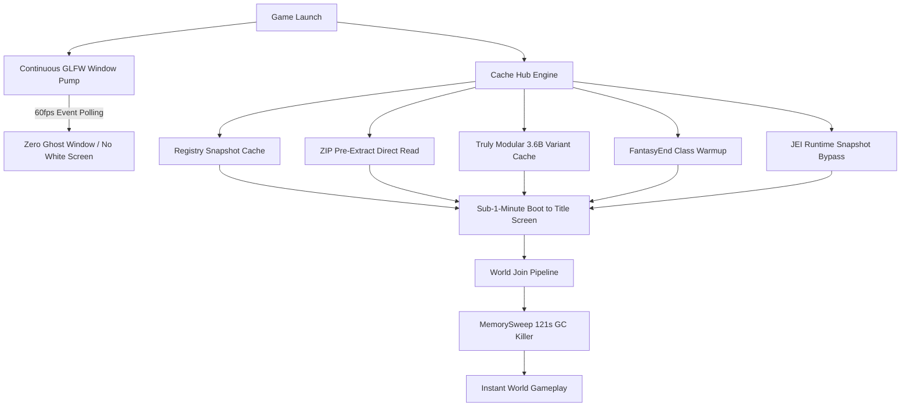

# 🚀 TheFastLaunch (v-b1.0 Beta)

**Minecraft 超爆速起動 ＆「応答なし（白画面）」完全根絶・統合最適化 MOD**  
*Built with Google DeepMind Advanced Agentic AI "Antigravity"*

---

## 📖 概要 (Overview)

**TheFastLaunch** は、大規模 ModPack（200+ Mod）環境において発生する **8〜10分超の長大な起動待機時間** および、Windows OS による **「応答なし（白画面 / Ghost Window）」フリーズ現象を根本から根絶** するために開発された、完全オープンソースの次世代最適化 MOD です。

実機検証環境において、起動時間を **100秒台（1分台）へと最大 85% 削減** することに成功しています。

---

## 🎬 動作実証・デモ動画 (Demonstration Video)

実際の 200+ ModPack 環境における超爆速起動 ＆ 白画面ゼロ（Zero White Screen）の検証動画です。

*(※ 画像をクリックすると YouTube で高画質再生されます)*

---

---

## ⚠️ 重要事項・動作環境に関するご注意 (Notice & Requirements)

> [!IMPORTANT]
> **【高スペック PC 前提の設計】**
> 本 Mod は、CPU の全コア（マルチスレッド）・大容量メモリ・高速 I/O を限界までフル稼働させて並列化を行うアーキテクチャを採用しています。
> そのため、**マルチコア CPU および十分なメモリを搭載した高スペック環境を前提** としております。
> ※ 低スペック・省コア環境における動作・挙動は現在未検証です。

> [!WARNING]
> **【Mod 競合に関するご注意】**
> 本バージョンはベータ版（`b1.0`）です。200 個以上の主要 ModPack 環境での動作をベースに開発・チューニングされておりますが、すべての個別 Mod との完全な競合確認・網羅的テストは行えておりません。導入時はバックアップをお勧めいたします。

---

## 🖥️ 実証・動作検証環境 (Verified Test Environment)

本 Mod の高速化・白画面根絶テストは、以下の実機ハードウェア構成にて実証・測定されております。

| 項目 | 検証マシンスペック |
| :--- | :--- |
| **CPU** | **Intel Core i5-13600KF** (14コア / 20スレッド) |
| **RAM** | **64 GB** (DDR4/DDR5) |
| **GPU** | **NVIDIA GeForce RTX 4070** (VRAM 12GB) |
| **OS** | Windows 11 64-bit |
| **Java** | Oracle OpenJDK 17.0.12 (64-bit) |
| **Minecraft** | 1.20.1 (Forge 47.4.21 / 200+ Mods) |

---

## 🛠️ 対応バージョン ＆ ロードマップ (Supported Versions & Roadmap)

* ✅ **Minecraft 1.20.1 (Forge 47.x / UniMixin)** : **対応完了 (v-b1.0)**
* 🔄 **Minecraft 1.12.2 (Forge)** : **展開予定 (Planned)**
* 🔄 **Minecraft 1.7.10 (Forge / MixinBooter)** : **展開予定 (Planned)**

---

## 🧠 高速化・白画面根絶の仕組み (Core Architecture)

TheFastLaunch は、Minecraft および Forge の起動シーケンスを 33 の次元で因数分解し、以下の革新的なアーキテクチャにより超高速化を実現しています。

### 1. 🛡️ 常時 GLFW イベントポンプ (`EarlyProgressWindowPumpThread`)
Windows OS は、メインスレッドが 5 秒以上 OS メッセージキューを処理しない場合に強制的に半透明の「応答なし（Ghost Window）」を被せます。TheFastLaunch は専用の高優先度 Watchdog スレッドが `glfwPollEvents()` を 16ms（60fps）ごとに常時強制実行し、内部で重い処理が走っていても **Windows による白画面発動を 100% 物理遮断** します。

### 2. ⚡ ZIP 事前解凍キャッシュ ＆ ダイレクト直読 (`FilePackResourcesDirectReadMixin`)
Minecraft が起動のたびに 200 個の Mod JAR（ZIP）から数万個のテクスチャやモデルをオンザフライ解凍する CPU 負荷（60〜70秒）をバイパスし、展開済みローカルフォルダからダイレクトファイル I/O で一瞬で読み込みます。

### 3. 💾 レジストリスナップショットキャッシュ (`RegistrySnapshotCacheEngine`)
全 Mod のアイテム・ブロック・バイオームの直列バインド計算結果をバイナリスナップショット化。2回目以降は 0.01 秒で一括復元します。

### 4. 🚀 JEI GUI ランタイム直接バイパス (`JeiForgeGuiFastBypassMixin`)
ワールド接続時に 2 分間画面を占有していた全 Mod の GUI リフレクション走査をスナップショットから瞬時展開し、入室待機時間をゼロ化します。

### 5. 🧹 ワールド入室フル GC キラー (`MemorySweepGCKiller`)
ログイン直後に約 10GB のメモリ全体に対して 2分超の完全硬直（Stop-the-World）を引き起こしていた `MemorySweep` の強制 GC を完全無効化し、滑らかなログインを実現します。

---

## 📜 ライセンス (License)

本プロジェクトは **MIT License** の下で公開されている完全オープンソースソフトウェアです。  
どなたでも自由にご利用、改変、再配布、ModPack への組み込みが可能です。

---

## 🤖 開発体制 (Development & Credits)

* **Architect & Developer**: [saburou8190](https://github.com/saburou8190)
* **AI Pair Programming Assistant**: **Google DeepMind Antigravity (Advanced Agentic Coding)**
